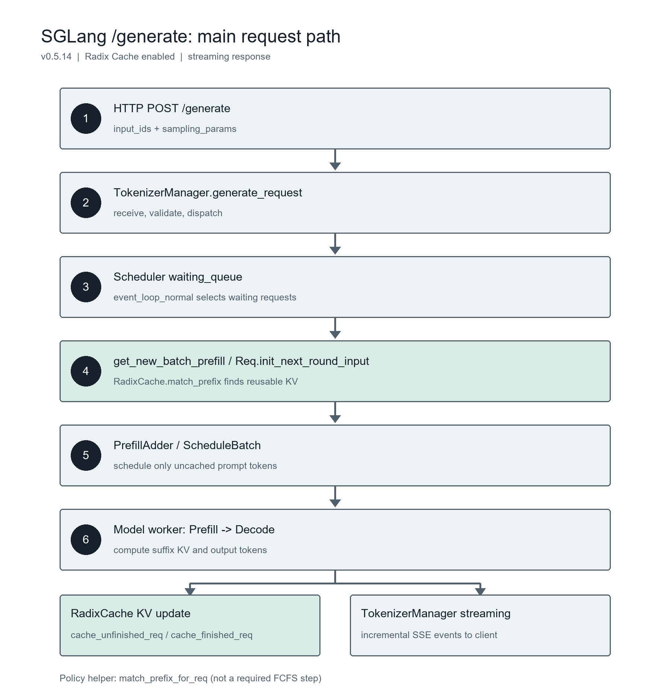

# 第二次挑战：SGLang 前缀缓存与请求处理流程

提交编号：102503110  
实验日期：2026-10-03  
GPU：NVIDIA GeForce RTX 5060（8151 MiB）  
环境：Ubuntu 22.04 / WSL 2，SGLang 0.5.14，Ray 2.56.0，Qwen/Qwen3-0.6B；Triton 注意力后端，Prefill CUDA Graph 关闭，Radix Cache 开启

## 一、任务一：前缀缓存测量

### 实验设置

通过原生 `/generate` 接口发送 `input_ids` 并读取流式 SSE。两组各 32 条测量请求，最大并发 8；每条输入 2112 token，生成 16 token。固定 `temperature=0`、`ignore_eos=true`、`sampling_seed=2026`。共享组输入为 2048 token 相同前缀和 64 token 独立后缀；分散组的首 token 各不相同。两组采用同一模型、请求编号顺序及并发设置。SGLang 服务运行在 WSL 2，测量客户端运行在同一台电脑的 Windows 侧，通过本机端口转发访问；因此延迟包含该本地转发开销，两组使用相同路径。

首次实验前发短请求预热服务。每组开始前等待前一组结束并确认 `POST /flush_cache` 成功；共享组额外发一条包含公共前缀的预热请求。这些预热请求不计入 32 条测量结果。

### 对照结果

下表来自 `results/target1/shared_prefix/summary.json` 与 `results/target1/dispersed_prefix/summary.json`；逐请求原始证据见各组 `requests.jsonl`。两组都完成 32 条请求，逐请求记录中的输入长度均为 2112 token，输出长度均为 16 token。

| 指标 | 共享前缀 | 分散前缀 |
|---|---:|---:|
| 成功率 | 32/32（100%） | 32/32（100%） |
| 吞吐量（请求/秒） | 44.95 | 6.56 |
| 缓存命中率 | 96.97% | 0% |
| 实际执行 Prefill token 总数 | 2,048 | 67,584 |
| TTFT p50 / p95（ms） | 65.85 / 70.57 | 705.02 / 1,045.76 |
| TPOT p50 / p95（ms） | 7.16 / 8.37 | 34.38 / 65.39 |
| 端到端延迟 p50 / p95（ms） | 176.02 / 181.22 | 1,219.30 / 1,223.56 |

缓存命中率 = `sum(cached_tokens) / sum(prompt_tokens)`。实际执行 Prefill token 数 = `sum(prompt_tokens - cached_tokens)`。共享组共有 67,584 prompt token，其中 65,536 token 被缓存命中，剩余 2,048 token 执行 Prefill；分散组 67,584 token 均执行 Prefill。两组 32 条测量请求全部成功，且输入和输出长度一致，共享组的缓存命中率更高、实际 Prefill token 更少，满足任务一的数值验收标准。

> **原理与数据解释：** Attention(Q, K, V) = softmax((QKᵀ / √dₖ) + M)V；Kᵢ = hᵢWₖ，Vᵢ = hᵢWᵥ。

因果掩码 M 使位置 i 只能依赖不晚于 i 的 token。对于同一模型、相同 token 和相同位置的前缀，逐层隐藏状态 h_i 相同，因此 K_i 和 V_i 可复用。命中后仍要为未命中的 64 token 后缀执行 Prefill；Prefill 的末位置 logits 用于产生第 1 个输出 token，随后执行 15 步 Decode，逐步产生第 2 至第 16 个输出 token。每步 Decode 计算上一输出 token 的 K/V，并读取已有前缀 K/V；请求结束时无需再为最后一个输出 token 执行前向计算。

实验中共享组的 TTFT p50 为 65.85 ms，分散组为 705.02 ms；p95 分别为 70.57 ms 和 1,045.76 ms。大量重复 Prefill 被省去，是首 token 时间显著缩短的主要原因。共享组的 TPOT p50 也从 34.38 ms 降至 7.16 ms；这不表示前缀缓存直接省去了 Decode 的 KV 计算，而是分散组在并发 8 下持续执行大量 Prefill，可能与 Decode 争用 GPU 和调度资源。端到端 p50 从 1,219.30 ms 降至 176.02 ms，同时反映了 Prefill、排队和逐 token 阶段的变化。该结论基于一次同配置对照运行；若需评估波动，应按相同条件重复运行并分别保存结果。

## 二、任务二：阅读一次 `/generate` 请求

以下文件位置根据官方 SGLang `v0.5.14` 标签源码（提交 `49e384ce9d304648e9959666ecb8ce8cd98d0deb`）核对。此实验使用默认 `fcfs` 调度；`match_prefix_for_req` 在调度策略中存在，但它不是该默认路径每条请求必经的函数。实际 Prefill 匹配由 `Req.init_next_round_input` 调用 Radix Cache 完成。

| 关键函数 | v0.5.14 源码文件与行号 |
|---|---|
| HTTP `/generate` 与 SSE 包装 | `sglang/srt/entrypoints/http_server.py:765` |
| `TokenizerManager.generate_request` / 请求发送 | `sglang/srt/managers/tokenizer_manager.py:576` / `:1319` |
| `Scheduler.event_loop_normal` / 等待队列入队 | `sglang/srt/managers/scheduler.py:1505` / `:2258` |
| `get_new_batch_prefill` / 取等待请求 | `sglang/srt/managers/scheduler.py:2702` / `:2816` |
| `match_prefix_for_req`（策略辅助路径） | `sglang/srt/managers/schedule_policy.py:85` |
| `Req.init_next_round_input`（本次默认路径） | `sglang/srt/managers/schedule_batch.py:1123` |
| `RadixCache.match_prefix` | `sglang/srt/mem_cache/radix_cache.py:358` |
| `PrefillAdder` / `ScheduleBatch` | `sglang/srt/managers/schedule_policy.py:425` / `sglang/srt/managers/schedule_batch.py:1671` |
| model worker 的前向计算 | `sglang/srt/managers/tp_worker.py:482` |
| `cache_finished_req` / `cache_unfinished_req` | `sglang/srt/mem_cache/radix_cache.py:438` / `:485` |
| 流式输出与客户端返回 | `sglang/srt/managers/scheduler_components/output_streamer.py:91`、`sglang/srt/managers/tokenizer_manager.py:1425`、`sglang/srt/entrypoints/http_server.py:773` |

HTTP 层把 `/generate` 交给 `TokenizerManager.generate_request`；TokenizerManager 通过 `_send_one_request` 将请求发送给调度器。调度器的 `event_loop_normal` 收取请求，`handle_generate_request` 构造 `Req`，普通请求经 `_add_request_to_queue` 进入 `waiting_queue`。`get_new_batch_prefill` 从等待队列选择请求，`Req.init_next_round_input` 调用 `RadixCache.match_prefix` 获取可复用 KV 的索引，并把 `extend_input_len` 设为总输入长度减去命中长度；`PrefillAdder` 据此分配本轮需要计算的 token，`ScheduleBatch` 交给 model worker 执行 Prefill 和后续 Decode。`match_prefix_for_req` 是调度策略的匹配辅助函数，本次默认 FCFS 不以它作为必经节点。请求继续运行或结束时，结果处理器经 `maybe_cache_unfinished_req` 或 `release_kv_cache` 调用 Radix Cache 的写回函数。输出流经调度器 `OutputStreamer`、Detokenizer、TokenizerManager `_wait_one_response`，最后由 HTTP 层包装成 SSE `data:` 事件返回客户端。

## 三、作业感受

### （1）如何完成第二次挑战

这次挑战的重点是实验对照设计和源码主流程追踪。我先在 WSL 2 中确认 SGLang 0.5.14、Ray 2.56.0 和本地 Qwen3-0.6B 模型，启动开启 Radix Cache 的服务；随后在 Windows 侧用 Python 标准库 `urllib` 与 8 个工作线程编写流式 `/generate` 客户端。脚本先发送短请求预热服务，再分别对共享前缀组和分散前缀组调用 `/flush_cache`，共享组额外发送公共前缀预热请求。两组各发送 32 条输入长度相同的请求，保存逐请求的 SSE 事件、缓存指标和延迟，并用校验脚本检查 32/32 成功及输入输出长度。正式结果是一轮同配置对照，未将多次复跑写成已经完成的工作。

任务二结合第一次挑战的 Pipeline 图，沿 `/generate` 请求入口、TokenizerManager、Scheduler 等待队列、RadixCache 前缀匹配、Prefill/Decode、缓存写回与流式输出追踪官方 v0.5.14 源码。我用符号定位脚本记录函数所在文件及行号，再检查默认 FCFS 调度下的实际调用关系；其中 `match_prefix_for_req` 是调度策略辅助路径，不能简单画成所有请求必经的节点。AI 帮助搭建实验与检索脚本、核对统计公式和梳理调用关系，结论再与保存的原始数据和对应源码核对。

### （2）最困难的部分及克服方法

我觉得最困难的是控制前缀缓存实验的比较条件，并把因果注意力公式与实测延迟联系起来。缓存状态、服务预热、并发调度和本机 Windows 到 WSL 的端口转发都会影响时间测量。因此在正式记录前先用短请求预热；每组开始前确认前一组请求结束并成功调用 `/flush_cache`；固定模型、输入输出长度、请求顺序、最大并发数和采样参数。逐请求保存原始事件，再检查缓存命中数、实际 Prefill token 数以及 TTFT、TPOT 和端到端延迟，避免只看汇总表。

理论上，我从因果掩码出发理解同一 token、同一位置的历史前缀为何可以复用逐层 K/V。命中前缀后，仍需计算未命中的后缀和新生成的 token。数据中共享组的 TTFT p50 明显较低；TPOT p50 也从分散组的 34.38 ms 降到 7.16 ms，不能说两组基本持平。我的理解是，分散组持续执行较长 Prefill，在并发负载下可能影响 Decode 调度；仅凭这一轮对照无法把 TPOT 差异全部归因于缓存本身。把统计量、公式和执行过程逐项对齐，是这部分工作最需要耐心的地方。

### （3）从 0 到 1 的科研工作与启发

以前我对“做科研”的理解可能比较狭隘，总觉得就是憋出一个更厉害的模型或者写个新奇的算法。但这次顺着 SGLang 的代码和论文啃了一圈，我最大的感受是：工业级或者系统级的科研，真的是“从泥坑里抠细节”抠出来的。

如果说这种从 0 到 1 的系统研究需要包含什么，我觉得核心就三件事。第一，对痛点的敏感：多轮对话或者 Few-shot 里有大量重复 Prompt，RadixCache 抓住了重复计算问题，用前缀树组织可复用的 KV。科研往往是从大家习以为常的低效现象里找解法。第二，扎实的底层控制力：只有“前缀树”这个点子不够，还要处理 GPU 内存、异步调度、锁机制等真实系统中的细节。第三，严密的对照实验：缓存没刷干净或并发波动都可能扰乱数据，必须证明提升确实来自被研究的机制。

对我自己的启发是，别怕看源码。带着明确问题沿调用链追踪，庞大的系统也可以一点点拆解明白。还要认真对待不符合预期的数据；不能挑一组好看的数据交差，而要追问预热、显存状态和调度等可能的原因，并通过后续重复实验检验解释。这种刨根问底的耐心，是科研新手需要补的一课。
